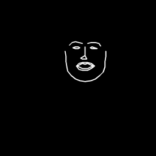
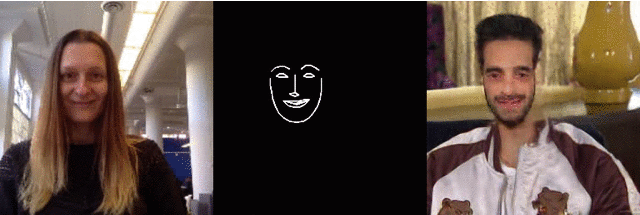
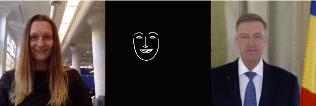

# facial_expression_transfer

This is a pix2pix demo that learns from facial landmarks and translates this into a face. A webcam-enabled application is also provided that translates your face to the trained face in real-time.

This project comes in three repositories. This repository, for general purpose scripts and documentation, and a forked version of the [face2face](https://github.com/datitran/face2face-demo) and [pix2pix-tensorflow](https://github.com/affinelayer/pix2pix-tensorflow)  repositories added as submodules. The presentation slides for this project are provided as [Google Slides](https://bit.ly/2TzdxPB).

<p align='center'>  
    
</p>

## Getting Started

### 1. Prepare Environment

- Clone this repository recursively to include the two forked repositories mentioned above.
```
git clone https://github.com/alina1021/facial_expression_transfer.git --recursive
cd facial_expression_transfer
```

- Create the conda environment from file (Mac OSX)
```
conda env create -f environment.yml
# activate this environment
conda activate facial_expression_transfer
```
### 2. Generate Training Data

```
cd face2face-demo
python generate_train_data.py --file ../iohannis_christmas_speech.mp4 --num 400 --landmark-model ../shape_predictor_68_face_landmarks.dat
```

Input:

- `file` is the name of the video file from which you want to create the data set.
- `num` is the number of train data to be created.
- `landmark-model` is the facial landmark model that is used to detect the landmarks. A pre-trained facial landmark model is provided [here](http://dlib.net/files/shape_predictor_68_face_landmarks.dat.bz2).

Output:

- Two folders `original` and `landmarks` will be created.

If you want to download this dataset, here is also the [video file](https://drive.google.com/file/d/1JGN6uulKeRS6adWbRHmIDaWKcrmKyRKq/view?usp=sharing) that I used and the generated [training dataset](https://drive.google.com/file/d/1KXfM_aC5GCRFKYls62r_sEpHV6nipOW-/view?usp=sharing) (400 images already split into training and validation).

### 3. Train Model

```
cd ..
# Move the original and landmarks folder into the pix2pix-tensorflow folder
mkdir pix2pix-tensorflow/photos
mv face2face-demo/original pix2pix-tensorflow/photos/original
mv face2face-demo/landmarks pix2pix-tensorflow/photos/landmarks
rm -rf face2face-demo/landmarks

# Go into the pix2pix-tensorflow folder
cd pix2pix-tensorflow/

# Resize original images
python tools/process.py \
  --input_dir photos/original \
  --operation resize \
  --output_dir photos/original_resized

# Resize landmark images
python tools/process.py \
  --input_dir photos/landmarks \
  --operation resize \
  --output_dir photos/landmarks_resized

# Combine both resized original and landmark images
python tools/process.py \
  --input_dir photos/landmarks_resized \
  --b_dir photos/original_resized \
  --operation combine \
  --output_dir photos/combined

# Split into train/val set
python tools/split.py \
  --dir photos/combined

# Train the model on the data
python pix2pix.py \
  --mode train \
  --output_dir face2face-model \
  --max_epochs 200 \
  --input_dir photos/combined/train \
  --which_direction AtoB
```
Training the model was done on AWS could service using EC2 p2.xlarge instances. The p2.xlarge instance has 1 NVIDIA K80 GPU with 2,496 parallel processing cores. The training takes up to 8 hours depending the actual settings like number of frames, epochs, etc... For example, training the model using 400 frames (320 for training and 80 for validation) and 200 epochs, takes about 5 hours on 1 NVIDIA K80 GPU. The Training on CPU was excluded right away since it takes 3-5 days with the above settings, depending on the CPU type.  
See the Pix2Pix model graph in TensorFlow below:
<p align='center'>  
    
</p>

Here are now some results for the discriminator and generator loss functions as a function of step number at epoch 200 when using 400 frame. Note the learning process for both the discriminator and generator was quite noisy and it gets better after more steps. 
<p align='center'>  
    
</p>
<p align='center'>  
    
</p>


### 4. Test Model / Validation

Testing is done with `--mode test`. You should specify the checkpoint to use with `--checkpoint`, this should point to the output_dir that you created previously with `--mode` train:

```
# test the model
python pix2pix.py \
  --mode test \
  --output_dir face2face_test \
  --input_dir photos/combined/val \
  --checkpoint face2face-model
```

The testing mode will load some of the configuration options from the checkpoint provided so you do not need to specify which_direction for instance.

The test run will output an HTML file at face2face_test/index.html that shows input/output/target image sets like the following:



For more information around training and testing, have a look at Christopher Hesse's [pix2pix-tensorflow](https://github.com/affinelayer/pix2pix-tensorflow) implementation.

### 5. Export Model

1. First, we need to reduce the trained model so that we can use an image tensor as input:
    ```
    python ../face2face-demo/reduce_model.py --model-input face2face-model --model-output face2face-reduced-model
    ```

    Input:

    - `model-input` is the model folder to be imported.
    - `model-output` is the model (reduced) folder to be exported.

    Output:

    - It returns a reduced model with less weights file size than the original model.

2. Second, we freeze the reduced model to a single file.
    ```
    python ../face2face-demo/freeze_model.py --model-folder face2face-reduced-model
    ```

    Input:

    - `model-folder` is the model folder of the reduced model.

    Output:

    - It returns a frozen model file `frozen_model.pb` in the model folder.

### 6. Run Demo

```
cd ..

# run recorded video
python scripts/run_video.py --source my_video.mov --show 1 --landmark-model ../shape_predictor_68_face_landmarks.dat --tf-model pix2pix-tensorflow/face2face-reduced-model/frozen_model.pb

# run webcam
python scripts/run_webcam.py --source 0 --show 1 --landmark-model ../shape_predictor_68_face_landmarks.dat --tf-model pix2pix-tensorflow/face2face-reduced-model/frozen_model.pb
```

Input:

- `source` is your video (my_video.mov) or the device index of the camera (default=0).
- I provide my recorded video, my_video.mov file, [here](https://drive.google.com/file/d/1YH2b88ot5nmVQ7ZucKuwYLW3c3uZKvbs/view?usp=sharing).
- `show` is an option to either display the normal input (0) or the normal input and the facial landmark (1) alongside the generated image (default=0).
- `landmark-model` is the facial landmark model that is used to detect the landmarks.
- `tf-model` is the frozen model file.


## Models

### Gianina Alina Negoita - Maluma 256x256

Me, my face and output:



Pre-trained frozen model [here](https://drive.google.com/file/d/1FZ1RL9BCIulKMrX_v2hicYLv80SB55ws/view?usp=sharing). The video file used to generate the training and validation datasets for this example is [here](https://drive.google.com/file/d/1_jUfWx5sk1E_aVvEnaTIXYJbGlf1PZdp/view?usp=sharing). This model is trained on 400 images with epoch 200.

### Gianin Alina Negoita - Klaus Iohannis 256x256

Me, my face and output:



Frozen model can be downloaded from [here](https://drive.google.com/file/d/1C5bN5J6_W9Zxs304nMyFiByieqbH-w_J/view?usp=sharing). This model is trained on 400 images with epoch 200.

## Requirements
- [Anaconda / Python 3.5](https://www.continuum.io/downloads)
- [TensorFlow 1.2](https://www.tensorflow.org/)
- [OpenCV 3.0](http://opencv.org/)
- [Dlib 19.4](http://dlib.net/)

## Acknowledgments

Thanks to [Dat Tran](http://www.dat-tran.com/) for inspiration, code and model! 

For training and testing, thanks to Christopher Hesse for [Image-to-Image Translation in Tensorflow](https://affinelayer.com/pix2pix/) code and examples.

Thanks also to Phillip Isola<sup>1</sup>, Jun-Yan Zhu<sup>1</sup>, Tinghui Zhou<sup>1</sup>, and Alexei A Efros<sup>1</sup> for their fantastic work on [Image-to-Image Translation Using Conditional Adversarial Networks](https://arxiv.org/pdf/1611.07004v1.pdf). 

<sup>1</sup> Berkeley AI Research (BAIR) Laboratory, University of California, Berkeley

## Copyright

This project is licensed under the MIT License - see the [LICENSE](LICENSE) file for details and the license of the other projects used within this repository.

